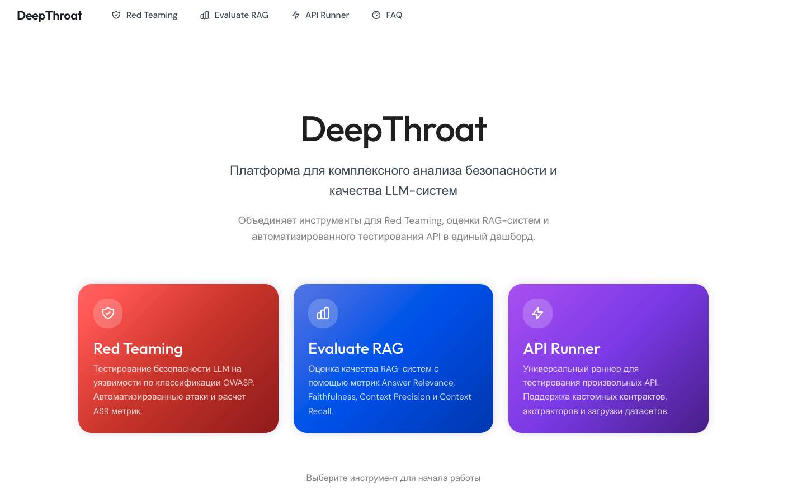

<div align="center">

# DeepThroath

### LLM Security & Quality Platform

*Comprehensive testing platform for LLM systems: Red Teaming, RAG Evaluation, and Universal API Testing*

[](https://nextjs.org/)
[](https://www.python.org/)
[](LICENSE)
[](https://www.typescriptlang.org/)

[Features](#features) • [Quick Start](#quick-start) • [Documentation](#documentation) • [Architecture](#architecture) • [Contributing](#contributing)



</div>

---

## Features

DeepThroath is an **API-first platform** that unifies three powerful LLM testing tools into a single, beautiful dashboard:

### Red Teaming
Proactively test your LLM against security vulnerabilities following **OWASP LLM Top 10**:
- Prompt Injection attacks
- Jailbreak attempts
- PII extraction testing
- Toxicity detection
- Context manipulation
- Automated adversarial prompt generation
- LLM-as-a-judge evaluation
- Comprehensive security reports

### RAG Evaluation
Assess RAG system quality via **two independent frameworks** — DeepEval and RAGAS — from a single interface on the `/eval` page.

**DeepEval (4 core metrics):**
- **Answer Relevancy** (≥0.7) — Does the answer match the question?
- **Faithfulness** (≥0.8) — Is the answer grounded in context? (No hallucinations)
- **Contextual Precision** (≥0.7) — Are relevant chunks ranked first?
- **Contextual Recall** (≥0.6) — Were all relevant chunks retrieved?

**RAGAS (RAGAS 0.4.x framework):**
- Same 4 standard metrics plus custom metrics support
- Custom metrics via `eval/custom_metrics/` — drop a Python file, auto-discovered at runtime
- Built-in example: `completeness` metric (answer completeness via LLM judge)
- Dataset-based evaluation
- Live API testing
- A/B testing support

### API Runner
Universal tool for testing **any LLM API**:
- Batch request processing
- Real-time progress monitoring
- Performance metrics (latency, tokens, cost)
- Rate limiting & retry strategies
- Dataset upload (CSV, JSON, TXT)
- Export results for analysis
- Support for OpenAI, Anthropic, local models, and custom APIs

---

## Why DeepThroath?

| Feature | DeepThroath | Other Tools |
|---------|-------------|-------------|
| **Unified Dashboard** | All-in-one: Red Team + RAG + API Testing | Separate tools |
| **API-First** | Works with any LLM API | Limited to specific providers |
| **Beautiful UI** | Modern Next.js with MiniMax design | CLI-only or basic UIs |
| **Production Ready** | Docker, CI/CD integration | Research projects |
| **Self-Hosted** | Full control, no data sharing | Cloud-only SaaS |
| **Comprehensive Metrics** | Security + Quality + Performance | Single focus |

---

## Quick Start

### Prerequisites

- **Node.js** 18+ and npm
- **Python** 3.11+
- API keys for LLM providers (OpenAI, Anthropic, OpenRouter, etc.)

### Installation

```bash
# Clone the repository
git clone https://github.com/InfernYaCr/DeepThroath.git
cd DeepThroath

# Install Python dependencies
python -m venv .venv
source .venv/bin/activate  # On Windows: .venv\Scripts\activate
pip install -r requirements.txt

# Install Node.js dependencies
cd web
npm install
cd ..

# Setup environment variables
cp .env.example .env
cp eval/.env.example eval/.env
```

### Configuration

Edit `.env` and `eval/.env` with your API keys:

```bash
# .env (Red Team)
OPENROUTER_API_KEY=your_key_here
ANTHROPIC_API_KEY=your_key_here

# eval/.env (RAG Evaluation)
OPENROUTER_API_KEY=your_key_here
JUDGE_MODEL=qwen/qwen-2.5-72b-instruct
```

### Launch Dashboard

```bash
cd web
npm run dev
```

Open [http://localhost:3000](http://localhost:3000) in your browser.

---

## Documentation

### Red Teaming

**Run security scan:**

```bash
source .venv/bin/activate

# Default scan
python scripts/run_redteam.py

# Custom target and judge
python scripts/run_redteam.py --target qwen-72b --judge qwen-72b-or
```

**Results:**
- Saved to `results/*.parquet`
- Displayed in **Security** tab of dashboard
- Includes: Security Score, ASR (Attack Success Rate), OWASP breakdown, attack logs

**Configuration:**
- Attack vectors: `config/attack_config.yaml`
- Target models: `config/targets.yaml`

---

### RAG Evaluation — DeepEval

**Offline evaluation (dataset-based):**

```bash
cd eval
source ../.venv/bin/activate

# Quick test (1 question)
python scripts/run_eval.py --input datasets/dataset.json --limit 1

# Full dataset
python scripts/run_eval.py --input datasets/dataset.json

# Custom judge and parallelism
python scripts/run_eval.py \
  --input datasets/dataset.json \
  --judge qwen-235b-or \
  --workers 3
```

**Online evaluation (live API):**

```bash
# Test with live RAG API
python scripts/run_eval.py \
  --input datasets/dataset.json \
  --online \
  --api-url https://your-rag-api.com/query \
  --limit 1

# Full dataset evaluation
python scripts/run_eval.py \
  --input datasets/dataset.json \
  --online \
  --api-url https://your-rag-api.com/query
```

**Results:**

Located in `eval/results/<timestamp>_<dataset_name>/`:

| File | Description |
|------|-------------|
| `report.md` | Human-readable report with metrics summary |
| `metrics.json` | Detailed scores and judge reasoning |
| `metrics.csv` | Tabular format for Excel/Pandas |
| `api_responses.json` | Raw API responses (question → answer + chunks) |
| `errors_log.json` | API errors and timeouts |

---

### RAG Evaluation — RAGAS

**Run RAGAS pipeline:**

```bash
cd eval
source ../.venv/bin/activate

# Quick test (3 questions)
python eval_ragas_metrics.py --limit 3

# Full dataset with specific judge
python eval_ragas_metrics.py --judge gpt4o-mini-or

# Custom judge from config
# Edit eval/config/eval_config.yaml → default_judge
```

**Results:** saved to `eval/results/<timestamp>_ragas/metrics.json`

**Custom Metrics:**

Drop a `.py` file into `eval/custom_metrics/` — auto-discovered at runtime:

```python
# eval/custom_metrics/my_metric.py
from dataclasses import dataclass, field
from pydantic import BaseModel
from ragas.dataset_schema import SingleTurnSample
from ragas.metrics.base import MetricWithLLM, SingleTurnMetric
from ragas.prompt import PydanticPrompt

class MyInput(BaseModel):
    question: str
    answer: str

class MyOutput(BaseModel):
    score: float
    reason: str

class MyPrompt(PydanticPrompt[MyInput, MyOutput]):
    instruction = "Score the answer 0.0–1.0. Return JSON with score and reason."
    input_model = MyInput
    output_model = MyOutput

@dataclass
class MyCustomMetric(MetricWithLLM, SingleTurnMetric):
    name: str = "my_metric"
    prompt: MyPrompt = field(default_factory=MyPrompt)

    async def _single_turn_ascore(self, sample: SingleTurnSample, callbacks=None) -> float:
        out = await self.prompt.generate(
            data=MyInput(question=sample.user_input or "", answer=sample.response or ""),
            llm=self.llm,
        )
        return max(0.0, min(1.0, float(out.score)))
```

See `eval/readme_ragas.md` for full architecture and nuances.

**Supported LLM Judges (both frameworks):**

| Judge | Model | Recommendation |
|-------|-------|----------------|
| `gpt4o-mini-or` | openai/gpt-4o-mini | **Default (RAGAS)** — Reliable JSON output |
| `qwen-72b-or` | qwen/qwen-2.5-72b-instruct | **Default (DeepEval)** — Fast & quality |
| `qwen-235b-or` | qwen/qwen3-235b-a22b | Maximum accuracy |
| `gpt4o-or` | openai/gpt-4o | High precision |
| `gemini-flash` | google/gemini-flash-1.5 | Most cost-effective |

---

### API Runner

**Use the Dashboard UI:**

1. Navigate to **API Runner** tab
2. Upload your dataset (CSV, JSON, or TXT)
3. Configure:
   - API endpoint URL
   - HTTP method (POST/GET)
   - Headers (API keys)
   - Request body template
   - Rate limiting settings
4. Click **Start Runner**
5. Monitor real-time progress
6. Export results when complete

**Dataset Format:**

```json
[
  {"id": "1", "prompt": "What is the capital of France?"},
  {"id": "2", "prompt": "Explain quantum computing"}
]
```

**Request Template:**

Use `{{prompt}}` as placeholder:

```json
{
  "model": "gpt-4",
  "messages": [
    {"role": "user", "content": "{{prompt}}"}
  ]
}
```

---

## Architecture

```
DeepThroath/
├── web/                          # Next.js 16 Frontend
│   ├── src/app/
│   │   ├── page.tsx              # Home page
│   │   ├── redteam/page.tsx      # Red Team dashboard
│   │   ├── eval/page.tsx         # RAG Evaluation dashboard
│   │   ├── runner/page.tsx       # API Runner dashboard
│   │   ├── faq/page.tsx          # Documentation & FAQ
│   │   └── layout.tsx            # Root layout with navigation
│   └── public/                   # Static assets
│
├── src/                          # Red Team Module (Python)
│   ├── red_team/                 # Attack generation & execution
│   ├── dashboard/                # Streamlit (legacy)
│   └── reports/                  # PDF/Markdown report generation
│
├── eval/                         # RAG Evaluation Module (Python)
│   ├── eval_rag_metrics.py       # DeepEval pipeline
│   ├── eval_ragas_metrics.py     # RAGAS 0.4.x pipeline
│   ├── custom_metrics/           # Auto-discovered RAGAS custom metrics
│   │   ├── example_metric.py     # Completeness metric (template)
│   │   └── resort_tone.py        # Resort tone custom metric
│   ├── readme_ragas.md           # RAGAS architecture & nuances
│   ├── scripts/
│   │   ├── run_eval.py           # DeepEval CLI runner
│   │   └── convert_dataset.py   # Dataset converter
│   ├── datasets/                 # Question datasets
│   ├── config/
│   │   ├── eval_config.yaml      # Judge settings (default_judge)
│   │   └── targets.yaml          # LLM judge configurations
│   └── results/                  # Evaluation results (auto-generated)
│       ├── <ts>_<name>/          # DeepEval results
│       └── <ts>_ragas/           # RAGAS results
│
├── tests/
│   └── eval/                     # Pytest tests for RAG metrics
│       ├── conftest.py           # Fixtures & API response caching
│       └── test_rag_deepeval.py  # 4 metrics + edge cases
│
├── scripts/
│   └── run_redteam.py            # Red team CLI runner
│
├── config/
│   ├── attack_config.yaml        # Attack vectors & OWASP categories
│   └── targets.yaml              # Target LLM configurations
│
└── results/                      # Red team scan results (parquet)
```

### Technology Stack

**Frontend:**
- Next.js 16.2.2 (App Router)
- React 19 (Server Components)
- TypeScript 5
- Tailwind CSS v4
- MiniMax Design System

**Backend:**
- Python 3.11+
- FastAPI (planned for API endpoints)
- DeepEval (RAG metrics)
- Pandas & Polars (data processing)

**LLM Integration:**
- OpenRouter
- Anthropic Claude
- OpenAI GPT
- Google Gemini
- Local models (Ollama, vLLM)

---

## Docker Deployment

```bash
# Build and run with Docker Compose
docker-compose up -d

# Access dashboard
open http://localhost:3000
```

**docker-compose.yml:**

```yaml
version: '3.8'

services:
  web:
    build: ./web
    ports:
      - "3000:3000"
    environment:
      - NODE_ENV=production
    volumes:
      - ./web:/app
      - /app/node_modules

  api:
    build: .
    ports:
      - "8000:8000"
    environment:
      - OPENROUTER_API_KEY=${OPENROUTER_API_KEY}
      - ANTHROPIC_API_KEY=${ANTHROPIC_API_KEY}
    volumes:
      - ./results:/app/results
      - ./eval/results:/app/eval/results
```

---

## Security & Privacy

**DeepThroath is designed with security in mind:**

✓ **Self-Hosted** — Deploy on your own infrastructure
✓ **No Data Sharing** — All requests go directly to your APIs
✓ **API Key Safety** — Keys stored in `.env`, never committed
✓ **No Telemetry** — Zero tracking or external data transmission
✓ **Private Cloud Ready** — Works in airgapped environments

**Best Practices:**
- Use `.env` files for API keys (never commit to Git)
- Enable RBAC for team deployments
- Rotate API keys regularly
- Use read-only API keys where possible
- Implement secrets management (Vault, AWS Secrets Manager)

---

## Use Cases

### For ML/AI Engineers
- Test model robustness against adversarial attacks
- Benchmark RAG system quality
- A/B test different embedding models or retrieval strategies
- Monitor production LLM performance

### For Security Teams
- Validate LLM security posture
- Red team chatbots before production
- Identify prompt injection vulnerabilities
- Generate security audit reports

### For Product Teams
- Track LLM quality metrics over time
- Compare different LLM providers (OpenAI vs Anthropic vs local)
- Measure improvement after prompt engineering
- Cost optimization through performance analysis

### For DevOps/QA
- Automate LLM testing in CI/CD pipelines
- Load testing for LLM APIs
- Regression testing for chatbot updates
- Integration testing with custom APIs

---

## Roadmap

- [ ] **Advanced Red Team Attacks** — Indirect prompt injection, multi-turn attacks
- [x] **RAGAS Integration** — Second eval framework with auto-discovered custom metrics
- [ ] **More RAG Metrics** — Answer similarity, semantic consistency
- [ ] **Historical Analytics** — Trend analysis, comparative dashboards
- [ ] **API Management** — Built-in rate limiting, caching, load balancing
- [ ] **Team Collaboration** — User roles, shared workspaces
- [ ] **Webhooks & Integrations** — Slack, Discord, PagerDuty notifications
- [ ] **CLI Tool** — Standalone CLI for CI/CD integration
- [ ] **REST API** — Programmatic access to all features
- [ ] **Multi-tenancy** — Support for multiple teams/projects
- [ ] **Cloud Version** — Managed SaaS offering (optional)

---

## Contributing

We welcome contributions! Here's how to get started:

1. **Fork the repository**
2. **Create a feature branch**: `git checkout -b feature/amazing-feature`
3. **Make your changes** and commit: `git commit -m 'Add amazing feature'`
4. **Push to your branch**: `git push origin feature/amazing-feature`
5. **Open a Pull Request**

**Development Guidelines:**
- Follow existing code style (Prettier for TypeScript, Black for Python)
- Add tests for new features
- Update documentation as needed
- Keep commits atomic and well-described

---

## Troubleshooting

**Dashboard won't start:**
```bash
cd web
kill $(lsof -ti:3000)  # Kill process on port 3000
npm run dev
```

**Rate limit errors (429):**
```bash
# Reduce parallelism
python scripts/run_eval.py --input file.json --workers 1
```

**API timeout errors (504):**
```bash
# Decrease concurrency
python scripts/run_eval.py --input file.json --workers 1
```

**Missing retrieval context (FA/CP/CR not calculated):**
```bash
# Use online mode to fetch chunks from live API
python scripts/run_eval.py --input file.json --online --api-url https://your-api.com
```

**Python dependencies issues:**
```bash
# Clean reinstall
rm -rf .venv
python -m venv .venv
source .venv/bin/activate
pip install --upgrade pip
pip install -r requirements.txt
```

---

## License

This project is licensed under the **MIT License** — see the [LICENSE](LICENSE) file for details.

---

## Acknowledgments

Built with:
- [Next.js](https://nextjs.org/) — React framework
- [DeepEval](https://github.com/confident-ai/deepeval) — LLM evaluation framework
- [RAGAS](https://github.com/explodinggradients/ragas) — RAG evaluation framework
- [Tailwind CSS](https://tailwindcss.com/) — Utility-first CSS
- [OpenRouter](https://openrouter.ai/) — Unified LLM API
- [Anthropic](https://www.anthropic.com/) — Claude API

Inspired by:
- OWASP LLM Top 10
- DeepEval metrics framework
- Modern security testing practices

---

<div align="center">

**Built with ❤️ for the LLM Security Community**

[⭐ Star us on GitHub](https://github.com/InfernYaCr/DeepThroath) • [Report Bug](https://github.com/InfernYaCr/DeepThroath/issues) • [Request Feature](https://github.com/InfernYaCr/DeepThroath/issues)

</div>
